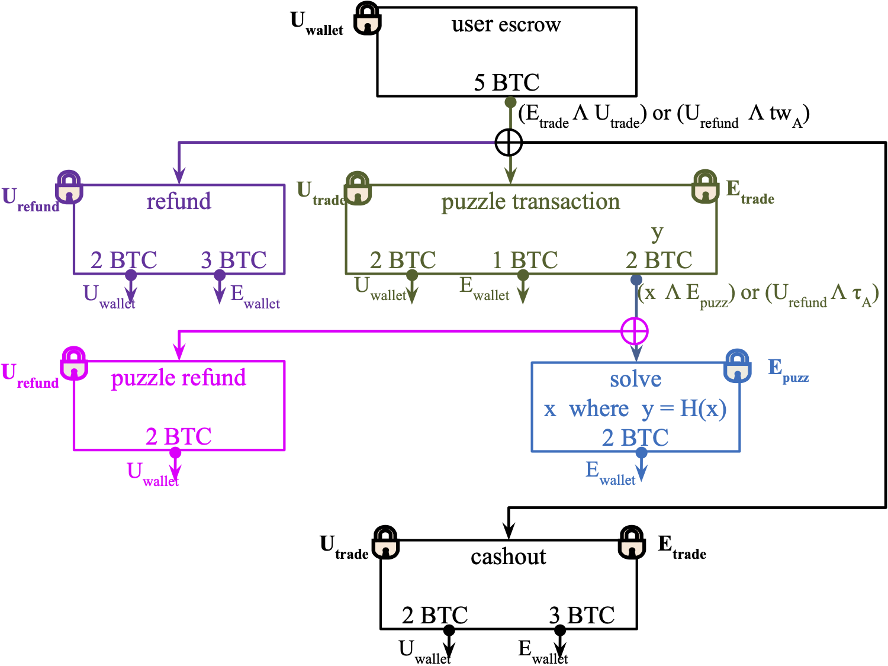
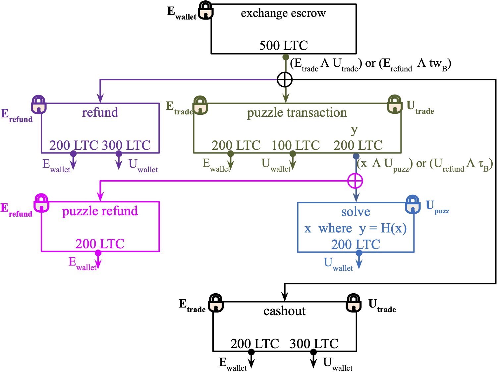
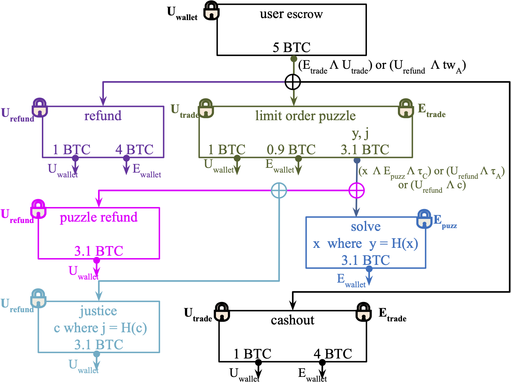

# Arwen Scripts

The [Arwen](https://arwen.io/) [protocol](https://arwen.io/whitepaper.pdf) provides secure, decentralized settlement for crypto exchanges and OTC trading between BTC, BCH, LTC and ETH using escrows. These script based smart contracts in this repo enable non-custodial trading on Bitcoin and Bitcoin-derived coins.


## RFQ scripts
Smart contracts i.e. Bitcoin-script P2SH redeem-scripts used in our unidirectional RFQ protocol




### User Escrow:

```
OP_DEPTH, OP_3, OP_EQUAL
OP_IF
  OP_2, OP_PUSH <User Trade Key>, OP_PUSH <Exchange Trade Key>, OP_2, OP_CHECKMULTISIG
OP_ELSE 
  OP_PUSH <twA>, OP_CHECKLOCKTIMEVERIFY, OP_DROP
  OP_PUSH <User Refund Key>, OP_CHECKSIG
OP_ENDIF
```

### User Escrow Puzzle Transaction (Puzzle Output):

```
OP_DEPTH, OP_2, OP_EQUAL
OP_IF
  OP_RIPEMD160, OP_PUSH <puzzle>, OP_EQUALVERIFY
  OP_PUSH <Exchange Puzzle Pubkey>, OP_CHECKSIG  
OP_ELSE
  OP_PUSH <tauA>, OP_CHECKLOCKTIMEVERIFY, OP_DROP
  OP_PUSH <Alice Puzzle Pubkey>, OP_CHECKSIG
OP_ENDIF    
```




### Exchange Escrow:

```
OP_DEPTH, OP_3, OP_EQUAL
OP_IF
  OP_2, OP_PUSH <Exchange Trade Key>, OP_PUSH <User Trade Key>, OP_2, OP_CHECKMULTISIG
OP_ELSE 
  OP_PUSH <twB>, OP_CHECKLOCKTIMEVERIFY, OP_DROP
  OP_PUSH <Exchange Refund Key>, OP_CHECKSIG
OP_ENDIF
```

### Exchange Escrow Puzzle Transaction (Puzzle Output):

```
OP_DEPTH, OP_2, OP_EQUAL
OP_IF
  OP_RIPEMD160, OP_PUSH <puzzle>, OP_EQUALVERIFY
  OP_PUSH <Alice Puzzle Pubkey>, OP_CHECKSIG  
OP_ELSE
  OP_PUSH <tauB>, OP_CHECKLOCKTIMEVERIFY, OP_DROP
  OP_PUSH <Exchange Refund Pubkey>, OP_CHECKSIG
OP_ENDIF
```


## Unidirectional Limit orders

Below is the bitcoin-script P2SH redeem-scripts used in our unidirectional limit orders. All scripts are the same as our unidirectional RFQ protocol smart contracts given above except for the user escrow puzzle transaction. The released Arwen software does not currently support limit orders.




### User Escrow Puzzle Transaction (Puzzle Output):

```
OP_1, OP_EQUAL
OP_IF
  OP_PUSH <tauC>, OP_CHECKLOCKTIMEVERIFY, OP_DROP
  OP_RIPEMD160, OP_PUSH <puzzle>, OP_EQUALVERIFY
  OP_PUSH <Exchange Puzzle Pubkey>, OP_CHECKSIG
OP_ELSE
  OP_PUSH <Alice Refund Pubkey>, OP_CHECKSIGVERIFY
  OP_DEPTH, OP_1, OP_EQUAL
  OP_IF
    OP_RIPEMD160, OP_PUSH <cancel>, OP_EQUALVERIFY
  OP_ELSE
    OP_PUSH <tauA>, OP_CHECKLOCKTIMEVERIFY, OP_DROP
  OP_ENDIF
OP_ENDIF
```